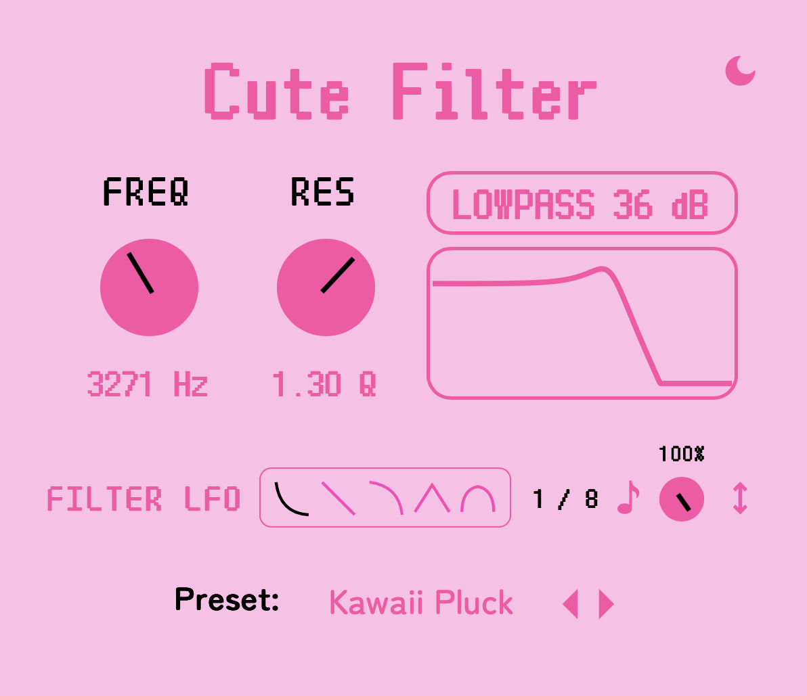

# Cute Filter

Cute Filter is a VST plugin for filtering (lowpass, highpass, bandpass).

### Controls:
- Frequency - the filter cutoff frequency
- Resonance - the filter resonance
- Filter Type - the filter type (lowpass/highpass/bandpass) and slope (12/24/36/48)
- Filter LFO Waveform - pick from saw, saw exp, saw log, triangle, and sine shapes for the filter LFO. 
- Filter LFO Rate - the speed of the filter LFO in bpm synced times.
- Filter LFO Amount - the amount of the filter LFO effect applied.
- Filter LFO Invert - inverts the phase of the filter LFO.

Most plugins use State Variable Filters (I think) but they sound pretty plain... this plugin uses Biquad 
filters which I found to be great for getting a kawaii character. 

### Design

Our design is available here: https://www.figma.com/design/bDssWO2ixIN2Owd5liCKIl/Cute-Filter

### See Also

- [Cute Gain](https://github.com/Moebytes/Cute-Gain) 
- [Cute Pitch](https://github.com/Moebytes/Cute-Pitch)
- [Cute Crush](https://github.com/Moebytes/Cute-Crush)